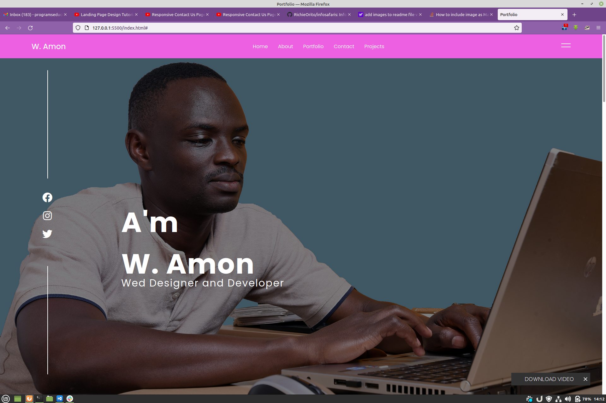
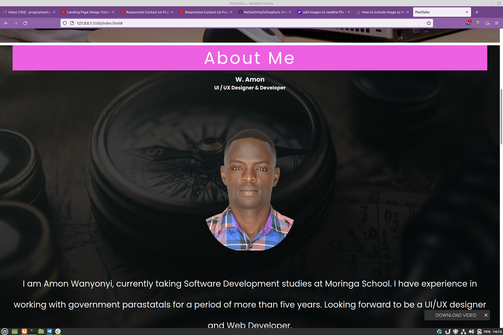
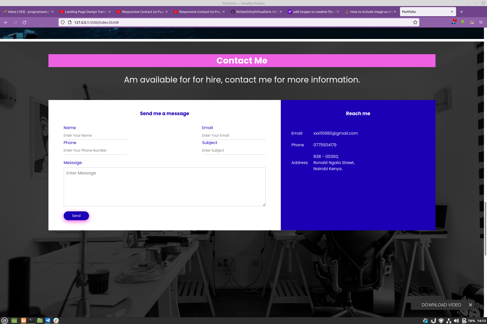

# My Portfolio.
## My portfolio is all about me, the skills I have and what I can do.
## I have given link to my github repository for some of the projects I have created.

# Technologies.
## To make this portfolio I have used HTML for the structuring and CSS for styling.

# Landing Page.

# About Me page.

# Contact me Page.
